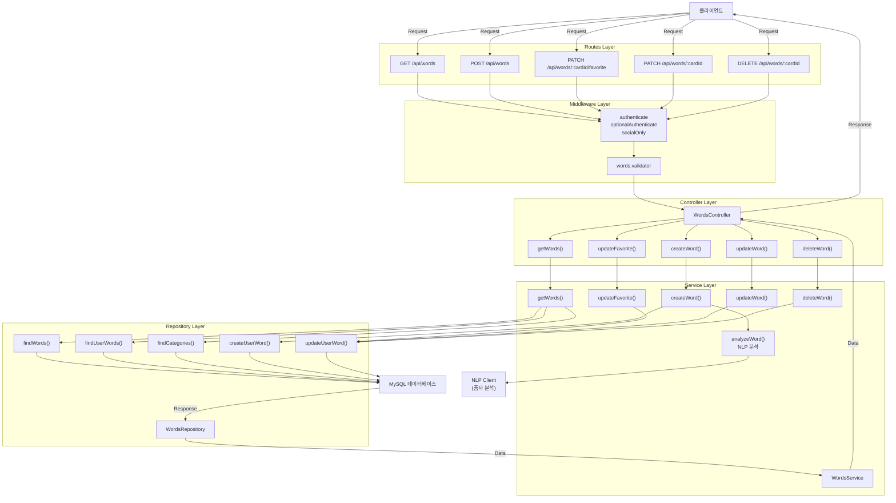
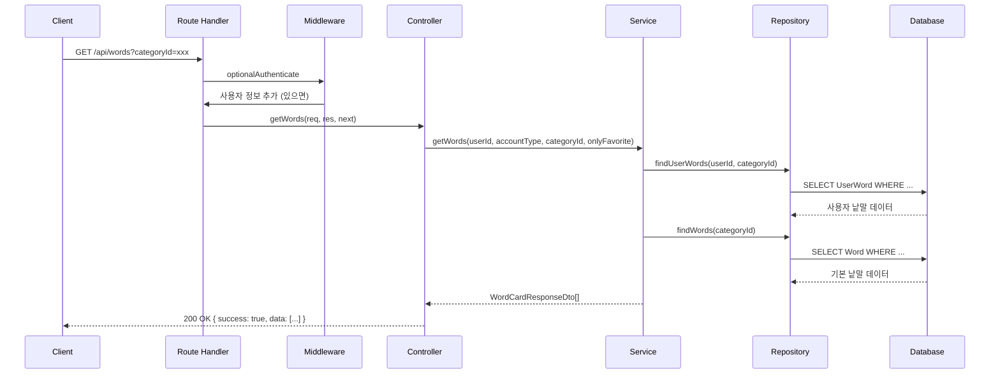
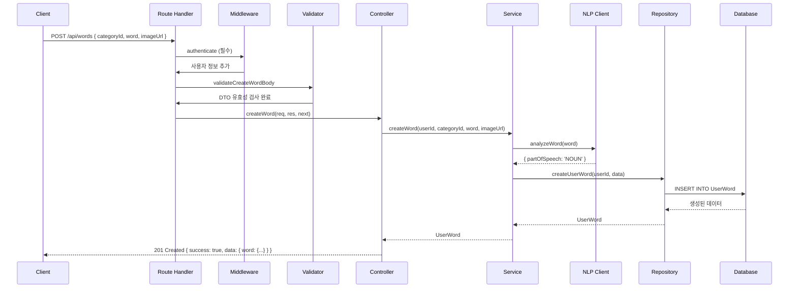

# Words Module (낱말 모듈)

낱말 카드 관리, 즐겨찾기, 커스텀 낱말 추가 기능을 담당하는 모듈입니다.

## 📋 API 엔드포인트

| 메서드 | 엔드포인트 | 설명 | 인증 |
|--------|----------|------|------|
| GET | `/api/words` | 낱말 카드 조회 | 선택 |
| POST | `/api/words` | 개인 낱말 카드 추가 | 필수 |
| PATCH | `/api/words/:cardId/favorite` | 즐겨찾기 변경 | 필수 |
| PATCH | `/api/words/:cardId` | 낱말 카드 수정 | 필수 |
| DELETE | `/api/words/:cardId` | 낱말 카드 삭제 | 필수 |
| PATCH | `/api/words/reorder` | 낱말 순서 변경 | 필수 |

## 🏗️ 아키텍처

### 계층별 구조 및 데이터 흐름



### 디렉토리 구조

```
words/
├── controllers/
│   └── words.controller.js       # 요청 처리 및 응답 반환
├── dto/
│   └── words.dto.js             # 데이터 전송 객체 및 유효성 검증
├── middlewares/
│   └── words.validator.js       # 요청 데이터 검증
├── repositories/
│   └── words.repository.js      # 데이터베이스 쿼리
├── routes/
│   └── words.route.js           # API 엔드포인트 정의
├── services/
│   └── words.service.js         # 비즈니스 로직
└── README.md                     # 모듈 문서
```

## 📊 요청/응답 흐름

### 예시 1: 낱말 조회 (GET /api/words)



### 예시 2: 낱말 추가 (POST /api/words)



## 🔄 핵심 비즈니스 로직

### 1. 낱말 조회 로직
- **토큰 없음**: 기본 낱말(isDefault=true)만 반환
- **토큰 있음 (게스트/소셜)**: 
  - 기본 낱말 + 사용자 커스텀 낱말
  - 즐겨찾기 필터링 지원
  - `onlyFavorite=true` 시 즐겨찾기만 조회

### 2. 낱말 추가 로직
- 사용자 입력 낱말에 대해 **NLP 분석**으로 자동 품사 결정
- 사용자 카테고리가 없으면 기본 카테고리에 맵핑
- `displayOrder` 자동 계산

### 3. 즐겨찾기/수정/삭제 로직
- **soft delete** 적용 (`isDeleted` 플래그 사용)
- 사용자별 독립적 데이터 관리
- 카테고리 변경 시 `userCategoryId` 업데이트

## 📝 DTO 정의

### GetWordsQueryDto
```javascript
{
  categoryId: string | null,      // 필터링 카테고리
  onlyFavorite: boolean           // 즐겨찾기만 조회
}
```

### CreateWordDto
```javascript
{
  categoryId: string,             // 필수
  word: string,                   // 필수
  imageUrl: string | null         // 선택
}
```

### UpdateFavoriteDto
```javascript
{
  isFavorite: boolean             // 필수
}
```

### UpdateWordDto
```javascript
{
  word: string | null,            // 낱말 텍스트
  imageUrl: string | null,        // 이미지 URL
  userCategoryId: string | null   // 카테고리 변경
}
```

### WordCardResponseDto
```javascript
{
  cardId: string,
  categoryId: string,
  categoryName: string,
  partOfSpeech: PartOfSpeech,
  word: string,
  imageUrl: string,
  isDefault: boolean,             // 기본 낱말 여부
  isFavorite: boolean,
  displayOrder: number
}
```

## 🔐 인증 정책

| 엔드포인트 | 매개변수 | 설명 |
|----------|--------|------|
| GET /api/words | optionalAuthenticate | 토큰 선택사항 |
| POST /api/words | authenticate | 토큰 필수 |
| PATCH /api/words/:cardId/favorite | authenticate | 토큰 필수 |
| PATCH /api/words/:cardId | authenticate | 토큰 필수 |
| DELETE /api/words/:cardId | authenticate | 토큰 필수 |

## 🗂️ 데이터베이스 모델

### Word (기본 낱말)
- `id`, `categoryId`, `partOfSpeech`, `word`, `imageUrl`, `isDefault`
- 앱에서 제공하는 기본 낱말 카드

### UserWord (사용자 낱말)
- `id`, `userId`, `userCategoryId`, `partOfSpeech`, `customWord`, `customImageUrl`, `displayOrder`, `isFavorite`, `isDeleted`
- 사용자가 추가한 커스텀 낱말

### UserCategory (사용자 카테고리)
- `id`, `userId`, `categoryName`, `displayOrder`, `iconKey`, `iconUrl`
- 사용자가 생성한 커스텀 카테고리

## 🚀 사용 예시

### 기본 낱말 조회
```bash
curl -X GET "http://localhost:3000/api/words"
```

### 사용자 낱말 조회 (인증 필요)
```bash
curl -X GET "http://localhost:3000/api/words" \
  -H "Authorization: Bearer <token>"
```

### 낱말 추가
```bash
curl -X POST "http://localhost:3000/api/words" \
  -H "Authorization: Bearer <token>" \
  -H "Content-Type: application/json" \
  -d {
    "categoryId": "uuid",
    "word": "물",
    "imageUrl": "https://..."
  }
```

### 즐겨찾기 변경
```bash
curl -X PATCH "http://localhost:3000/api/words/{cardId}/favorite" \
  -H "Authorization: Bearer <token>" \
  -H "Content-Type: application/json" \
  -d { "isFavorite": true }
```

## 📌 주요 특징

✅ **계층별 분리**: Routes → Controller → Service → Repository로 명확한 책임 분리  
✅ **DTO 기반 검증**: 모든 요청/응답 데이터 타입 안정성 보장  
✅ **NLP 자동 분석**: 낱말 추가 시 자동으로 품사 분석  
✅ **soft delete**: 삭제된 데이터 복구 가능  
✅ **즐겨찾기 지원**: 사용자별 맞춤 낱말 관리  
✅ **유연한 인증**: 토큰 없어도 기본 낱말은 사용 가능  

## 🔗 관련 모듈

- **auth**: 인증 미들웨어 (authenticate, socialOnly)
- **category**: 기본 카테고리 관리
- **utils/nlp.client.js**: 품사 분석
